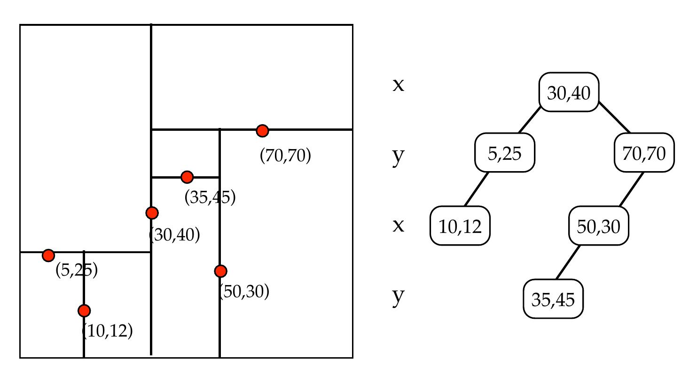

# Project: Kd-tree Version1

## Authors

|Name|Email|
|--------|--------|
|Haozheng Huang|haozheng.huang@tum.de|
|Yichao Gao|yichao.gao@tum.de|

## Instruction

### What is kd-tree?

The k-d tree is a binary tree in which every node is a k-dimensional point. Every non-leaf node can be thought of as implicitly generating a splitting hyperplane that divides the space into two parts, known as half-spaces. Points to the left of this hyperplane are represented by the left subtree of that node and points to the right of the hyperplane are represented by the right subtree. The hyperplane direction is chosen in the following way: every node in the tree is associated with one of the k dimensions, with the hyperplane perpendicular to that dimension's axis. You can find more [here](https://en.wikipedia.org/wiki/K-d_tree)


(Source: https://www.cs.cmu.edu/~ckingsf/bioinfo-lectures/kdtrees.pdf)

### How to search?

Take two-dimensional as an example, first we start from the root node, if the x value is greater than or equal to the root node, search in the right subtree, if the x value is smaller than the root node, search in the left subtree, if the x value and y value are the same, find it.

### How to insert?

Taking two-dimensional as an example again, inserting a node in the kd-tree is actually looking for a position that can be inserted. We start from the root node, if the x value is greater than the root node, insert it into the right subtree of the root. If the x value is smaller than the root node, it is inserted in the left subtree. Subtrees are inserted in the same way until a null location is found.

### How to delete?

We use the same method as searching to determine the position of the deletion point, and use the following steps to delete:

1. If the deletion point has no subtree, delete it directly.
2. If the deletion point has a right subtree, find the minimum value of the current dimension in the right subtree, and replace the node, and then delete that point again. 
3. If the deletion point has a left subtree, find the minimum value of the current dimension in the left subtree, and replace the node , then delete that point again, and finally move the entire left subtree to the right

We have generated the following functions:

- Kd-tree construction
- Points addition and deletion
- Read data from a csv file
- Print the kd-tree
- Find the min node of the tree
- KNN (kd-Trees Nearest Neighbor) search
- Test based on Gtest frame.

## How to build and run

Now the directory looks like this:

```bash
└─kd-tree
  |   README.md
  |   main.cpp
  |───data
  |      points.csv
  |      KNN_point.csv
  |───src
  |      kd-tree.cpp
  |      kd-tree.h
  |      helper.cpp
  |      helper.h
  |      CMakeLists.txt
  |───test
  |      kd-search-test.cpp
  |      CMakeLists.txt
```

From the csv file we can get the following data:

|Points| |
|--------|--------|
|2,5,0|3,8,-1|
|6,3,-2|8,9,-5|
|1,4,5|0,3,7|
|-3,5,11|-2,10,-6|
|9,10,-4|-3,3,3|


To build and run:

1. Run the command in the terminal.  

```bash
cmake .
```

   Then you will get a `Makefile` in the folder.

2. Run the command in the terminal.  

```bash
make 
```

   You will get the exe file: `main`

3. Run it.  

```bash
./main
```

   You will get this result on the terminal.

```bash
point overlap at dimension 0
              /-----(9, 10, -4)
       /-----(8, 9, -5)
/-----(3, 8, -1)
|      \-----(6, 3, -2)
(2, 5, 0)
|      /-----(-3, 5, 11)
|      |      \-----(-2, 10, -6)
\-----(1, 4, 5)
       \-----(0, 3, 7)
              \-----(-3, 3, 3)
nearest neighbour of (7, 8, -4): (8, 9, -5)
after deletion of point: (1, 4, 5)
              /-----(9, 10, -4)
       /-----(8, 9, -5)
/-----(3, 8, -1)
|      \-----(6, 3, -2)
(2, 5, 0)
|      /-----(-2, 10, -6)
\-----(-3, 5, 11)
       \-----(0, 3, 7)
              \-----(-3, 3, 3)
```
Judging by the results, we accomplished our stated goals of reading data from file, constructiong, addition and deleting trees well.

## How to test our search function

In the directory `test/` we have a `kd-search-test.cpp` based on the Gtest frame.

To test the function of KNN:

1. Under the directory `test/`, the directory now looks like this:

```bash
└─test/
    ├─ CMakeLists.txt
    └─ kd-search-test.cpp
```

   Clone and add `googletest`

```bash
git@github.com:google/googletest.git
```

2. Run these commands:

```bash
cmake .
make
```

3. Run the exe file

```bash
./kd-search-test
```

4. If all is right, you will see:

```bash
[==========] Running 2 tests from 1 test suite.
[----------] Global test environment set-up.
[----------] 2 tests from treetest
[ RUN      ] treetest.KNN_search
point overlap at dimension 0
[       OK ] treetest.KNN_search (0 ms)
[ RUN      ] treetest.find_min
point overlap at dimension 0
[ Message  ] This is the KD-Tree:
       /-----(9, 12, 24)
/-----(10, 4, 16)
(8, 8, 3)
\-----(5, 8, 6)
       \-----(2, 5, 1)
[       OK ] treetest.find_min (0 ms)
[----------] 2 tests from treetest (0 ms total)

[----------] Global test environment tear-down
[==========] 2 tests from 1 test suite ran. (0 ms total)
[  PASSED  ] 2 tests.
```

5. If `CMakeList.txt` works not good, you have also this alternative:

```bash
g++  kd-search-test.cpp -o kd-search-test -lgtest -lpt
./kd-search-test
```
